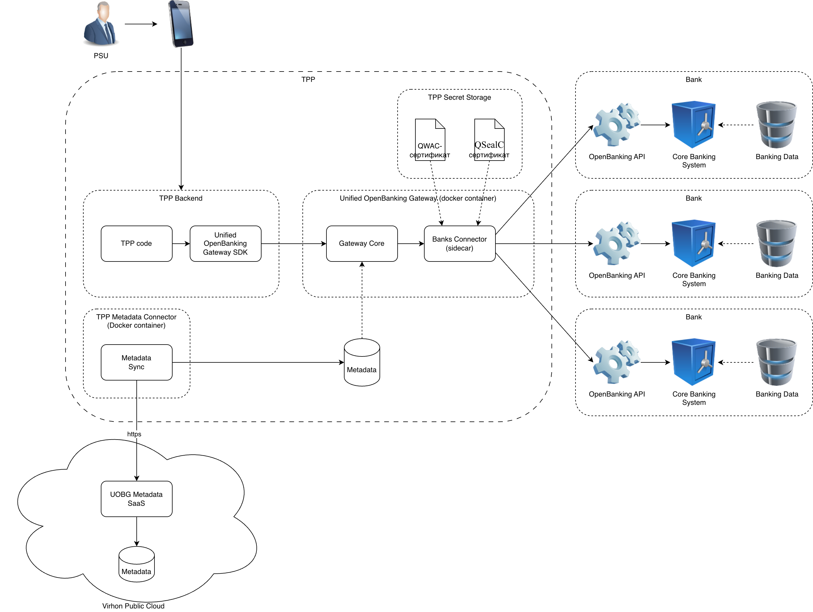

# Virhon Unified OpenBanking Gateway
Цей проєкт націлено на створення універсального 
API для доступу до банків через інтерфейс 
OpenBanking (UOBG). Цільова аудиторія цього проекту - TPP,
які мають ліцензії AISP або PISP, або обидві.

## Product
Продуктом цього проєкту є програмне забезпечення,
яке розгортається у вигляді docker-контейнеру в
периметрі TPP, та уніфікує доступ до API банків.

## Core Value
Ключова цінність цього продукту:
1. UOBG Є лише каналом доступу до API банків, не 
зберігає фінансової інформації користувачів
2. Розгортається в периметрі TPP, тобто TPP не 
мають передавати свої ключі та сертифікати 
посереднику
3. Дозволяє TPP зекономити кошти на розробку 
інтеграцій з кожним окремим банком власними 
ресурсами
4. Ядро продукту керується метаданими, що
полегшує додавання нових інтеграцій

## Архітектура

1. UOBG це не SaaS, він розгортається в периметрі TPP
2. GatewayCore - ядро системи. Відповідає за формування 
запитів до банків та розбір відповідей від банків
відповідно до метаданих
3. BanksConnector - sidecar, який відповідає за
безпосередню комунікацію з банками, накладання
підписів, встановлення mTLS з'єднання
4. QWAC, QSealC - сертифікати TPP, які зберігаються
в периметрі TPP
5. Metadata - сховище, яке зберігає правіла
перетворення запитів та відповідей